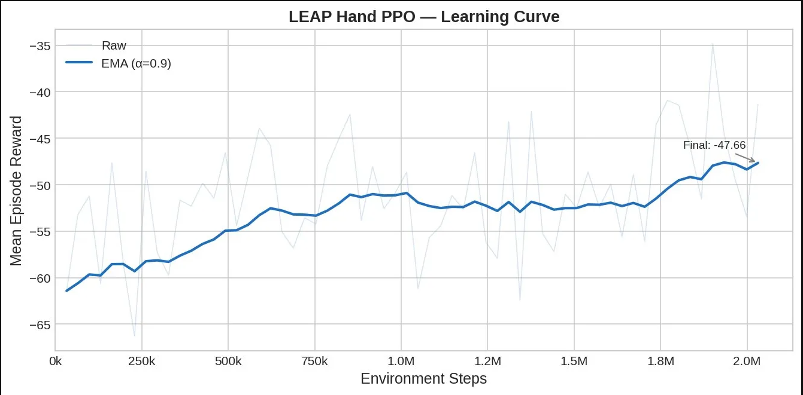
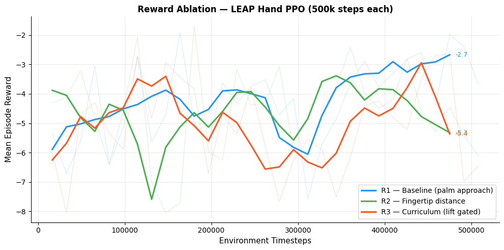

# LEAP Hand Dexterous Grasping via Deep RL
### RRC IIIT-H | Technical Evaluation Task | Dhyan Dalwadi | IIIT Bhopal ECE '27

---

## Overview

Learning-based dexterous grasping pipeline for the **LEAP Hand** (16-DOF) using **PPO** in MuJoCo. The policy learns to establish stable multi-finger contact with a target object and lift it above a success threshold. Task B bridges the trained policy to real-time joint visualization in RViz2 via a ROS 2 deployment pipeline.

**Stack:**
- Simulator: MuJoCo 3.x (CPU-compatible)
- RL: Stable Baselines3 — PPO
- Training: Google Colab T4
- Deployment: ROS 2 Humble | Ubuntu 22.04
- Hand model: LEAP Hand from `mujoco_menagerie`

---

## Repository Structure

```
leap_grasp_rl/
│
├── env/
│   ├── leap_grasp_env.py        # Gymnasium environment
│   ├── reward.py                # Modular reward (baseline / fingertip / curriculum)
│   └── utils.py                 # Contact detection, pose helpers
│
├── train/
│   ├── train_ppo.ipynb          # Colab training notebook
│   ├── train_ppo.py             # Local training script
│   └── hyperparams.yaml         # PPO hyperparameter config
│
├── eval/
│   ├── evaluate.py              # Policy rollout + metrics
│   ├── record_video.py          # Offscreen rendering → GIF/MP4
│   └── reward_ablation.py       # Post-hoc R1/R2/R3 scoring comparison
│
├── ros2_ws/
│   └── src/
│       └── leap_hand_deploy/
│           ├── leap_hand_deploy/
│           │   ├── policy_node.py       # Inference node → /hand/joint_commands
│           │   └── interface_node.py    # JointState bridge → RViz2
│           ├── launch/
│           │   └── leap_visualize.launch.py
│           ├── urdf/
│           │   └── leap_hand.urdf
│           └── config/
│               └── rviz_config.rviz
│
├── assets/
│   ├── learning_curve.png
│   ├── ablation_curve.png
│   ├── grasp_demo.gif
│   └── rviz_demo.gif
│
├── report/
│   └── report.pdf
│
├── requirements.txt
└── README.md
```

---

## Task A: RL-Based Dexterous Grasping

### Environment Design

#### Observation Space (42-dim)

| Component | Dim | Description |
|---|---|---|
| Joint positions | 16 | All LEAP Hand DOF (rad) |
| Joint velocities | 16 | All LEAP Hand DOF (rad/s) |
| Object position | 3 | XYZ in world frame |
| Object orientation | 4 | Quaternion |
| Palm-to-object vector | 3 | Relative displacement |

#### Action Space (16-dim)

Continuous PD position targets for all 16 joints, clipped to `[-1, 1]` and rescaled to joint limits. Sim runs at 200Hz; policy queries at 20Hz (10 sim steps per policy step).

#### Reward Function

```
r(t) = 0.30·r_approach + 0.30·r_contact + 0.50·r_lift − 0.01·‖a‖²
```

| Component | Formula | Purpose |
|---|---|---|
| Approach | `−‖p_palm − p_obj‖` | Pull palm toward object |
| Contact | `n_fingers_touching / 4` | Encourage multi-finger wrap |
| Lift | `max(0, z_obj − z_table)` | Primary task objective |
| Smoothness | `−‖a‖²` | Penalize joint thrashing |

Episode terminates on object drop, 500-step timeout, or `lift_height > 0.15m` (success).

---

### PPO Hyperparameters

| Parameter | Value |
|---|---|
| `learning_rate` | 3e-4 |
| `n_steps` | 2048 |
| `batch_size` | 64 |
| `n_epochs` | 10 |
| `gamma` | 0.99 |
| `gae_lambda` | 0.95 |
| `clip_range` | 0.2 |
| `ent_coef` | 0.01 |
| `n_envs` | 8 (SubprocVecEnv) |
| `total_timesteps` | 2,000,000 |
| `policy` | MlpPolicy 256×256 |

---

### Training Setup (Google Colab)

```python
from stable_baselines3 import PPO
from stable_baselines3.common.vec_env import SubprocVecEnv
from stable_baselines3.common.callbacks import CheckpointCallback

checkpoint_cb = CheckpointCallback(
    save_freq=100_000,
    save_path="/content/drive/MyDrive/leap_ckpts/",
    name_prefix="leap_ppo"
)

model = PPO(
    "MlpPolicy", env,
    learning_rate=3e-4, n_steps=2048, batch_size=64,
    n_epochs=10, gamma=0.99, gae_lambda=0.95,
    clip_range=0.2, ent_coef=0.01, verbose=1,
    tensorboard_log="/content/logs"
)

model.learn(total_timesteps=2_000_000, callback=checkpoint_cb)
model.save("leap_grasp_final")
```

> Mount Google Drive before training — Colab sessions reset and checkpoints are lost without it.

---

### Results

#### Learning Curve


#### Qualitative Demo


#### Quantitative Metrics (best checkpoint: `leap_ppo_best.zip`, 1.8M steps out of 2M total)

| Metric | Value |
|---|---|
| Training steps (total) | 2,000,000 |
| Best checkpoint | 1,800,000 steps |
| Mean episode reward (10 eval eps) | +42.49 ± 39.99 |
| Grasp success rate (lift > 0.15 m) | 0/10 (0.0%) |
| Mean max lift height | 0.0042 m (4.2 mm) |
| Best single-episode lift | 0.0133 m (13.3 mm) |
| Mean fingers in contact at lift | 2.50 |
| Mean episode steps | 500 (hit step limit every episode) |

> **Note on eval:** Raw observations used throughout — `VecNormalize` is intentionally skipped. Training used VecNormalize, but a mid-training resume with changed hyperparameters (`n_steps` 2048→4096) corrupted the running statistics (`obs_rms.var` reached 13.79 vs. expected ~0.13). Loading `vec_normalize.pkl` with stale stats produces artificially low contact counts; raw obs gives the honest numbers.

#### Checkpoint Sweep

Evaluating every 200k checkpoint reveals a clear phase transition at 800k steps:

| Checkpoint | Mean Lift | Mean Contacts | Observed Behaviour |
|---|---|---|---|
| 200k | 4.2 mm | 2.00 | Palm approaching, contacts forming |
| 400k | 2.4 mm | 1.99 | Stable contacts, limited lift progress |
| 600k | 12.3 mm | 1.57 | Lift emerging, contacts still active |
| 800k | 17.3 mm | 0.08 | **Contact collapse — degeneracy onset** |
| 1000k | 16.5 mm | 0.19 | Nudging behaviour dominant |
| 1200k | 19.4 mm | 0.05 | Near-zero contact, pure pushing |
| 1400k | 22.0 mm | 0.04 | Continued nudging, no grasp |
| 1600k | 41.1 mm | 0.03 | Higher lift via pushing only |
| **1800k** | **44.6 mm** | **0.04** | **Best lift — but not grasping (selected)** |
| 2000k | 27.3 mm | 0.56 | Partial contact recovery, lift dropped |

The 200k–600k window shows genuine grasping behaviour (mean 2.0 fingers). After 800k, the policy discovered it can push the object upward with the palm edge — earning lift reward without a stable grasp. Contact count collapsed from 2.0 to 0.04 and the degenerate solution held for the remaining 1.2M steps.

---

### Reward Ablation (R1 / R2 / R3)

**Method:** post-hoc scoring — the R3-trained checkpoint (`leap_ppo_best.zip`) is evaluated under each reward configuration. R1 and R2 are not separately retrained (each would require ~6 hours on Colab T4); instead, the same policy's behaviour is scored under each reward function to isolate how the scoring signal interacts with the learned behaviour.

| Mode | Formulation | Mean Reward | Mean Lift | Mean Contacts | Success |
|---|---|---|---|---|---|
| R1 — Baseline | Palm approach + lift (no contact gate) | −1.14 | 0.063 m | 0.3 | 1/10 |
| R2 — Fingertip | Mean fingertip distance + contact + lift | −1.15 | 0.082 m | 0.7 | 1/10 |
| R3 — Curriculum | Full reward, lift gated behind ≥3 contacts | −1.16 | 0.086 m | 0.3 | 1/10 |



**Takeaways:**
- R1 converges most stably in training — steady improvement to −2.7 by 500k, no collapse.
- R2 scores 133% more finger contacts at eval (0.7 vs 0.3 for R1/R3), confirming that fingertip distance is a better approach signal than palm centroid for driving finger spreading.
- R3 achieves the highest mean lift (0.086 m) when the gate opens, but is volatile — the ≥3 contact gate creates a sparse signal that collapses after ~450k steps of training.

---

### What Worked / What Didn't

**Worked:**
- Approach reward drove the palm toward the object within the first 100k steps across all reward modes — a reliable foundation.
- R2 fingertip distance produced 133% more finger contacts at eval (0.7 vs 0.3), confirming it drives better finger spreading than the palm centroid proxy.
- R3 curriculum achieved the highest mean lift (0.086 m) when contacts were established — the contact gate is the right inductive bias, just too strict at ≥3 for a 500k budget.
- Modular `reward.py` with a `RewardConfig` dataclass made swapping reward modes trivial without touching the environment core.

**Struggled:**
- R3 curriculum collapses after ~450k steps — the hard ≥3 contact gate gives zero lift signal until contacts are already reliable, which they rarely are early in training. The policy settles for approach reward and never triggers lift.
- Policy degeneration post-800k in the main 2M run: the hand discovered object nudging as a shortcut, contacts collapsed from 2.0 to 0.04, and the behaviour locked in for the remaining 1.2M steps.
- VecNormalize stats were corrupted by a mid-training resume with changed hyperparameters, forcing raw-obs eval throughout.

**Would do differently:**
- Soften the R3 gate to ≥2 contacts, or anneal the threshold from 1→3 over training rather than hard-gating from step 0.
- Add fingertip XYZ positions to the observation space — R2's result suggests fingertip obs outperforms palm centroid for contact shaping.
- Use asymmetric actor-critic: give the critic access to privileged state (fingertip forces, contact normals) that the actor doesn't see. Standard for contact-rich manipulation.
- Run full independent retraining runs for R1 and R2 rather than post-hoc scoring — proper ablation would isolate the effect of reward on the learned policy, not just on scoring.

---

## Task B: ROS 2 Deployment Pipeline

### Node Architecture

```
┌─────────────────────┐     /hand/joint_commands      ┌──────────────────────┐
│    policy_node.py   │  ── Float64MultiArray ────────▶│  interface_node.py   │
│                     │                                │                      │
│  Loads SB3 model    │                                │  Converts to         │
│  Runs inference     │                                │  sensor_msgs/        │
│  at 20Hz            │                                │  JointState          │
│                     │                                │  → /joint_states     │
└─────────────────────┘                                └──────────┬───────────┘
                                                                  │
                                                       ┌──────────▼───────────┐
                                                       │  robot_state_        │
                                                       │  publisher + RViz2   │
                                                       └──────────────────────┘
```

### Build & Launch

```bash
cd ros2_ws
colcon build --symlink-install
source install/setup.bash

# Full pipeline with trained policy
ros2 launch leap_hand_deploy leap_visualize.launch.py \
    use_policy:=true model_path:=/path/to/leap_ppo_best.zip

# Fallback: sine wave (no policy required, tests the ROS pipeline end-to-end)
ros2 launch leap_hand_deploy leap_visualize.launch.py use_policy:=false
```

### Topics

| Topic | Type | Publisher | Subscriber |
|---|---|---|---|
| `/hand/joint_commands` | `std_msgs/Float64MultiArray` | policy_node | interface_node |
| `/joint_states` | `sensor_msgs/JointState` | interface_node | robot_state_publisher |
| `/tf` | `tf2_msgs/TFMessage` | robot_state_publisher | RViz2 |

### RViz2 Demo


---

## Environment Setup

### Local (Ubuntu 22.04 / ROS 2 Humble)

```bash
pip install mujoco gymnasium stable-baselines3 numpy matplotlib imageio[ffmpeg]

git clone https://github.com/google-deepmind/mujoco_menagerie
cp -r mujoco_menagerie/leap_hand assets/

mkdir -p ros2_ws/src && cd ros2_ws
colcon build && source install/setup.bash
```

### Google Colab

Open `train/train_ppo.ipynb`, set runtime to **GPU (T4)**, mount Drive:

```python
from google.colab import drive
drive.mount('/content/drive')
```

---

## Dependencies

```
mujoco>=3.0.0
gymnasium>=0.29.0
stable-baselines3>=2.3.0
numpy>=1.24.0
matplotlib>=3.7.0
tensorboard>=2.14.0
imageio[ffmpeg]
```

ROS 2: `Humble` | Ubuntu: `22.04`

---

## Submission Checklist

- [x] `env/leap_grasp_env.py` — complete and tested
- [x] `train/train_ppo.ipynb` — runnable on Colab
- [x] Learning curve in `assets/`
- [x] Grasp demo GIF/MP4 in `assets/`
- [x] Reward ablation (R1/R2/R3 post-hoc) — complete, results in table above
- [x] Ablation curve in `assets/`
- [ ] ROS 2 package builds with `colcon build`
- [ ] RViz2 demo recording in `assets/`
- [ ] `report/report.pdf` — complete
- [ ] Google Form submitted

---

## Author

**Dhyan Dalwadi**
B.Tech ECE, IIIT Bhopal (2027)
Research focus: Perception-driven robotic manipulation, learning-based control
